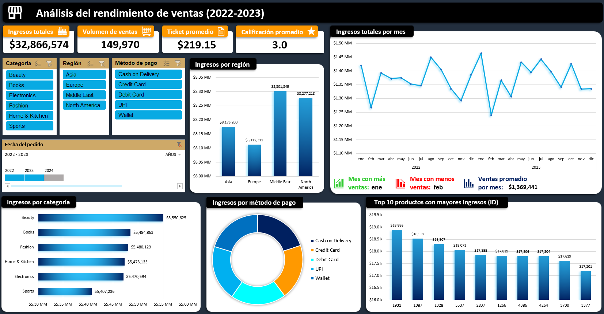

# **Análisis del rendimiento de ventas (2022-2023)**

Análisis del rendimiento de ventas de un e-commerce durante 2022-2023, desarrollado en Microsoft Excel. El proyecto incluye auditoría y preparación de datos, análisis exploratorio mediante tablas dinámicas y un dashboard interactivo para analizar ingresos, unidades vendidas y desempeño por diferentes dimensiones comerciales.

## Objetivo

El objetivo fue construir un dashboard en Excel que permitiera analizar el desempeño del negocio y detectar patrones en las ventas.

## Dataset

El dataset empleado contiene información de ventas de comercio electrónico durante el periodo 2022-2023. Incluye variables relacionadas con pedidos, productos, precios, descuentos, ingresos, regiones de los clientes, métodos de pago y valoraciones. Las principales variables son: `order_id`, `order_date`, `product_id`, `product_category`, `price`, `discount_percent`, `discounted_price`, `quantity_sold`, `total_revenue`, `customer_region`, `payment_method`, `rating` y `review_count`.

## Proceso de análisis

1. **Auditoría y limpieza:** validación de tipos de datos, valores faltantes, registros duplicados y consistencia de las métricas financieras.

2. **Enriquecimiento:** creación de variables temporales y métricas derivadas para facilitar el análisis.

3. **Análisis exploratorio (EDA):** utilización de tablas dinámicas para explorar las ventas por categoría, periodo, región y método de pago.

4. **Dashboard:** el dashboard permite explorar el rendimiento de ventas mediante KPIs, visualizaciones dinámicas, segmentadores y líneas de tiempo.

## Dashboard

El dashboard permite explorar el rendimiento de ventas mediante KPIs, visualizaciones dinámicas, segmentadores y líneas de tiempo.

## Principales hallazgos

* Los ingresos mensuales se mantienen relativamente estables durante el periodo 2022-2023, con valores cercanos al promedio mensual (~$1.35M).
* La región de Middle East presenta los mayores ingresos totales entre las regiones analizadas.
* La categoría Beauty genera los mayores ingresos entre las categorías analizadas, seguida por Books y Fashion.
* Una pequeña cantidad de productos concentra una parte significativa de los ingresos totales.

## Herramientas

* Microsoft Excel
* Tablas dinámicas
* Segmentadores
* Líneas de tiempo

## Archivos

Los archivos incluidos en el repositorio son:

* `data/`: dataset utilizado para el análisis.
* `excel/`: archivo de Excel con el análisis y dashboard interactivo.
* `documentation/`: documentación detallada del proyecto.
* `images/`: recursos gráficos utilizados en el README.

## Documentación

La [documentación completa](documentation/project_documentation.pdf) del proyecto incluye una descripción detallada sobre el proceso de análisis, las decisiones tomadas y los resultados.

## Fuente de datos

[Amazon Sales Dataset](https://www.kaggle.com/datasets/aliiihussain/amazon-sales-dataset), de Ali Hussain.
